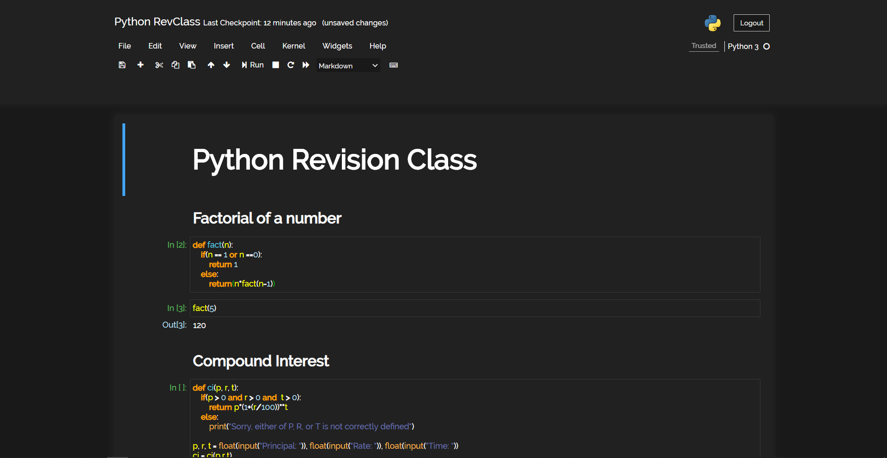

The Styling is loosely inspired by the following Screenshot I found on [StackOverflow](https://stackoverflow.com/questions/46510192/change-the-theme-in-jupyter-notebook):

I thought it would be a nice fit for an AI/Data Science related blog, and so I implemented it here.