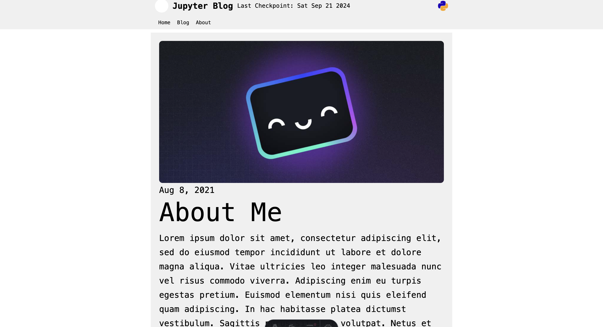
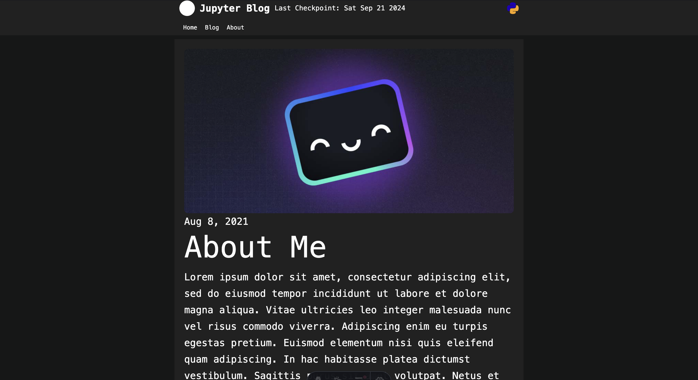

This blog template has light and dark mode implemented using Tailwind CSS.

You can also switch between themes in the `consts.ts` file by changing the `THEME` variable.

In the `Theme.ts` file, you can also change the theme colors or add your own theme.

> **Note:** I am By far not a designer, so the themes are not that great. If you have any suggestions for improvements, please create an issue or a pull request.

```ts
export const darkTheme: Theme = {
    text: {
        font: 'monospace',
        color: '#ffffff',
    },
    colors: {
        primary: '#212121',
        secondary: '#121212',
        siteBackground: '#161717',
        contentBackground: '#212121',
        text: '#ffffff',
    }
}

export const lightTheme: Theme = {
    text: {
        font: 'monospace',
        color: '#000000',
    },
    colors: {
        primary: '#ffffff',
        secondary: '#f0f0f0',
        siteBackground: '#ffffff',
        contentBackground: '#f0f0f0',
        text: '#000000',
    }
}
```

This is how the Light mode looks like:



This is how the Dark mode looks like:

